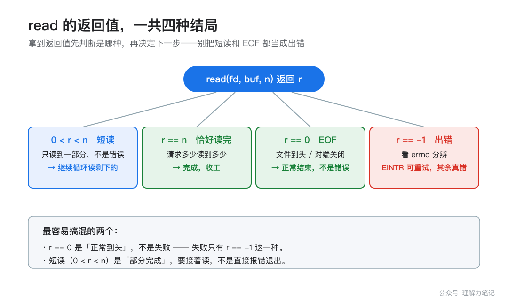

# read 只读了一半，不是你的代码错了

你一定写过（或抄过）这样的代码：

```c
char buf[4096];
ssize_t n = read(fd, buf, sizeof buf);
/* 然后理所当然地认为 buf 里装满了 4096 字节 */
```

如果 `read` 返回的不是 4096，而是 5，你会不会第一反应是「出 bug 了」？其实没有。**`read` 和 `write` 只承诺「最多」读/写 N 字节，实际返回多少是内核说了算，返回得少不一定是错。**

> **结论**：`read`/`write` 返回的字节数少于请求，叫**短读/短写（short read / short write）**，这是被允许的正常行为，不是 bug。`read` 返回 0 表示读到文件尾（EOF），返回 -1 才是出错（其中 `EINTR` 是「被信号打断」，可以重试）。正确的写法是把它们放进一个循环，累计已处理的字节数，直到「读满 / 读到 EOF / 遇到真错误」三者之一才停。

下面用三个能自己跑的小实验把这件事验证清楚，再讲它背后为什么这样设计、工程上怎么写才对。

---

## 第一章 · 先解决问题：短读短写是正常现象，用循环读完

先看一个最短的复现：用一个管道，子进程只写 5 个字节，父进程请求读 4096 字节，看它返回多少。

### 最小实验：请求读 4096，只读到 5

```c
/*
 * short_read.c — 证明 read 会「短读」：请求读 N 字节，实际可能只返回一部分。
 *
 * 方法：创建一个管道，父进程写一段固定长度（比如 5 字节）的内容，
 * 子进程一次 read 请求 4096 字节，观察返回 5 而不是 4096。
 */
#define _POSIX_C_SOURCE 200809L
#include <unistd.h>
#include <sys/wait.h>
#include <string.h>
#include <errno.h>

static int put_uint(char *dst, long v) {
    char tmp[24];
    int i = 0, j;
    if (v == 0) { dst[0] = '0'; return 1; }
    while (v > 0) { tmp[i++] = (char)('0' + (v % 10)); v /= 10; }
    for (j = 0; j < i; j++) dst[j] = tmp[i - 1 - j];
    return i;
}

static void say(const char *s) {
    write(1, s, strlen(s));
}

int main(void) {
    int fds[2];
    if (pipe(fds) < 0) {
        say("pipe failed\n");
        return 1;
    }

    pid_t pid = fork();
    if (pid < 0) {
        say("fork failed\n");
        return 1;
    }

    if (pid == 0) {
        /* 子进程：只写 5 字节，然后退出 */
        close(fds[0]);
        const char *msg = "hello";
        ssize_t w = write(fds[1], msg, 5);
        (void)w;
        close(fds[1]);
        return 0;
    }

    /* 父进程：请求读 4096 字节 */
    close(fds[1]);

    char buf[4096];
    char line[64];
    int n = 0;

    ssize_t r = read(fds[0], buf, sizeof buf);

    const char *p1 = "请求 read 4096 字节，实际返回 ";
    memcpy(line + n, p1, strlen(p1)); n += (int)strlen(p1);
    n += put_uint(line + n, (long)r);
    line[n++] = '\n';
    write(1, line, (size_t)n);

    close(fds[0]);
    waitpid(pid, NULL, 0);
    return 0;
}
```

（代码里用 `write` 手工拼输出而不是 `printf`，是为了让整个程序只依赖系统调用，输出不被标准库缓冲干扰。）

### 编译与运行

```sh
cc -std=c17 -Wall -Wextra -Wpedantic -Wconversion -Wshadow -O0 -g short_read.c -o short_read
./short_read
```

### 实际结果

```
请求 read 4096 字节，实际返回 5
```

### 结果说明

请求读 4096，`read` 返回了 5。这不是出错——管道里此刻就只有 5 字节，内核把这 5 字节给了你就立刻返回，不会傻等剩下的 4091 字节。**「有多少给多少」**，这就是短读。

短写也一样。把管道写满后再腾出 100 字节，此时请求写 65536 字节，`write` 只写进 100：

```
pipe filled: 65536 bytes
drained 100 bytes to make room
write #after-drain: asked 65536 bytes, wrote 100 bytes (SHORT WRITE)
```

一个很容易错的判断：**别把「返回值小于请求值」当成失败**。失败的唯一标志是返回 -1。短读短写时返回值是正的，程序必须把它当成「部分完成」继续处理，而不是直接当错误退出。


---

## 第二章 · 从操作系统视角理解：为什么内核「不肯一次给够」

为什么 read/write 会「不肯一次给够」？因为它们是系统调用，返回值由内核此刻的实际处理能力决定，而不是由你请求的字节数决定。

### 涉及的系统对象

- **内核缓冲区（页高速缓存 / socket 缓冲 / 管道缓冲）**：read 读的数据来自这里，write 写的数据先落在这里。管道、socket 的缓冲区大小有限；普通文件走页高速缓存，受内存与内核回写策略影响。
- **文件偏移量**：每次成功的 read/write 都会把偏移量往前推进「实际处理」的字节数，而不是「请求」的字节数。
- **信号**：阻塞中的系统调用被信号打断，是 EINTR 的来源。

### 调用路径与状态变化

`read(fd, buf, n)` 这个调用，内核做的事大致是：找到 fd 对应的打开文件描述 → 看内核缓冲区里有没有数据 → **有多少就拷多少到 buf，最多 n 字节** → 推进偏移量 → 返回实际拷贝的字节数。

关键在「有多少就拷多少」。对管道/socket/终端这些**流**型描述符，数据是「边到边读」的：对端写了 5 字节，缓冲区里就 5 字节，read 拿到的自然就是 5。你请求 4096，内核不会因为你的请求就阻塞到凑齐 4096——那会让「已经到的数据」白白等着，也让「先到先处理」的常见需求没法实现。

`write` 同理：缓冲区只剩 100 字节空位时，内核先写进 100 字节就返回 100，剩下的你自己再写。

### 返回值、错误和边界

`read` 的返回值一共四种情况，必须分清：

| 返回值 | 含义 | 怎么办 |
| --- | --- | --- |
| `> 0` 但 `< n` | 短读，只读了一部分 | 继续循环读剩下的 |
| `== n` | 恰好读满请求的量 | 完成 |
| `== 0` | EOF：文件到头，或对端关闭 | 正常结束，不是错误 |
| `== -1` | 出错 | 看 errno |

`== -1` 时还要再分一层：`errno == EINTR` 表示「读到任何数据之前被信号打断」，这是可重试的；其他 errno 是真正的错误，一般不该盲目重试。

有两个边界特别容易混淆：

1. **普通磁盘文件的 read，在 Linux 上「要么读满、要么返回 0」**——文件有固定长度，读到头就是 0，不存在「只读一半」的中间态。但这是 Linux 的实现行为，**不是 POSIX 的保证**。POSIX 只说 read 可能短读。所以可移植代码不能依赖「普通文件一定读满」这个假设，统一用循环最稳。

2. **EINTR 在不同系统上的行为不一样。** POSIX 允许实现「自动重启」被信号打断的慢系统调用；Linux 默认**不**自动重启（除非装信号处理器时设了 `SA_RESTART`），所以 Linux 上你必须自己处理 EINTR。结论：**写可移植代码，就显式处理 EINTR**，别赌系统帮你重启。

EINTR 不是嘴上说说，用一个小实验验证：让子进程阻塞 read 一个没人写的管道，父进程发个 SIGUSR1 把它打断。子进程先装一个**空的信号处理器**（`handler` 函数体为空，只为了不让 SIGUSR1 把进程杀掉——SIGUSR1 的默认动作是终止进程，不装处理器的话，子进程根本活不到检查 errno 那一行），然后发起 read：

```c
struct sigaction sa;
memset(&sa, 0, sizeof sa);
sa.sa_handler = handler;
sigemptyset(&sa.sa_mask);
/* 故意不设 SA_RESTART：这样阻塞中的 read 才会被打断返回 EINTR */
sigaction(SIGUSR1, &sa, NULL);
```

```c
char c;
ssize_t r = read(fds[0], &c, 1);
if (r < 0) {
    if (errno == EINTR)
        say("child: read interrupted, returned -1, errno == EINTR\n");
    else
        say("child: read failed with non-EINTR errno\n");
}
```

装了处理器但不设 `SA_RESTART`，被打断的 read 就会返回 -1。实际输出：

```
child: read interrupted, returned -1, errno == EINTR
```



---

## 第三章 · 工程上怎么使用：把 read/write 包成「循环 + 累计」

理解了「短读短写是正常的」，工程上的结论就一句话：**任何一次 read/write 都不能假设它一定处理了全部请求，必须循环处理。**

### 接口选择

- 只读/写一次就行的场景（比如读一个固定长度的小头、写一个状态字节），短读短写的概率低，但严谨起见仍建议循环或至少检查返回值。
- 需要「一次保证读完/写满」时，自己写 `read_all`/`write_all` 包装函数，别裸调 read/write。
- 对「在指定位置读写」的需求，POSIX 提供了 `pread`/`pwrite`（带偏移量参数，不移动文件偏移），但它们同样会短读短写，**循环这一层省不掉**。

### 错误处理

完整读的正确写法，三个终止条件一个都不能漏：

```c
/* 完整读：循环直到读满 n 字节、读到 EOF、或出错 */
static ssize_t read_all(int fd, void *buf, size_t n) {
    char *p = buf;
    size_t done = 0;
    while (done < n) {
        ssize_t r = read(fd, p + done, n - done);
        if (r < 0) {
            if (errno == EINTR)
                continue;              /* 被信号打断，重试 */
            return -1;                 /* 真正的错误 */
        }
        if (r == 0)
            break;                     /* EOF：读到头了，返回已读到的部分 */
        done += (size_t)r;
    }
    return (ssize_t)done;
}
```

三个终止条件对应：`done == n`（读满，循环条件自然退出）、`r == 0`（EOF）、`r < 0 && errno != EINTR`（真错误）。EINTR 单独 continue，不把它算进错误。

### 资源生命周期

- `read_all` 里每次 `read` 用的是同一个 fd，缓冲区指针 `p + done` 随累计推进，循环本身不新增任何需要清理的资源；fd 的开关仍归调用方管。
- 调用方拿到的返回值要区分：返回 `n` 是读满，返回 `0..n-1` 是提前 EOF（读到多少算多少），返回 -1 才是失败。**别把「提前 EOF」当失败**，很多协议/格式允许数据比预期短。

### 可复用写法

完整的 `write_all` 与 `read_all` 对称：

```c
/* 完整写：循环直到写满 n 字节，或出错 */
static ssize_t write_all(int fd, const void *buf, size_t n) {
    const char *p = buf;
    size_t done = 0;
    while (done < n) {
        ssize_t w = write(fd, p + done, n - done);
        if (w < 0) {
            if (errno == EINTR)
                continue;              /* 被信号打断，重试 */
            return -1;                 /* 真正的错误 */
        }
        done += (size_t)w;             /* 防短写：只累计实际写出的 */
    }
    return (ssize_t)done;
}
```

`write` 和 `read` 有一点不同：请求字节数非 0 时，`write` 正常不会返回 0，所以循环里不用专门判 0；但它照样会短写，`done += w`（而不是 `done += n`）就是为了这个。

两个函数合在一起验证过：`read_all` 从文件读 10 字节，`write_all` 写进另一个文件，再读回来逐字节比对，完全一致：

```
read_all got 10 bytes: [abcdefghij]
copy verified: write_all wrote all 10 bytes
```

---

## 第四章 · 面试提炼

### 简短回答

「read/write 返回的字节数少于请求是短读/短写，这是正常行为不是错误。read 返回 0 是 EOF，返回 -1 是出错，其中 EINTR 表示被信号打断可以重试。正确写法是循环累计，直到读满、读到 EOF 或遇到真错误。」

### 常见追问

- **read 返回 0 和返回 -1 有什么区别？** 0 是「文件到头 / 对端关闭」，是正常结束；-1 是「出错」，具体看 errno，EINTR 可重试，其他多半是硬错误。
- **为什么 read 会短读？** 因为对管道/socket/终端这些流，数据是边到边读的，内核「有多少给多少」，不会为了凑齐你请求的字节数而阻塞。
- **普通文件的 read 会短读吗？** Linux 上普通文件要么读满要么返回 0，不会出现中间态；但这是实现行为不是标准保证，可移植代码仍该用循环。

### 容易答错的地方

- 说「read 返回 0 是读失败」——错，0 是 EOF，是正常结束。
- 说「read 返回值小于请求值就是 bug」——错，短读短写是允许的。
- 说「EINTR 是严重错误、直接退出」——错，EINTR 是「被信号打断」，重试即可。
- 说「write 返回成功就落盘了」——错，write 成功只代表数据进了内核缓冲区，是否落盘是 fsync 的事。

---

## 参考资料

按支撑程度排序：

- [read(2) — Linux man-pages](https://man7.org/linux/man-pages/man2/read.2.html)：短读、EOF（返回 0）、EINTR、普通文件「读满或 0」的实现行为。
- [write(2) — Linux man-pages](https://man7.org/linux/man-pages/man2/write.2.html)：短写、EAGAIN、非阻塞语义。
- [pipe(7) — Linux man-pages](https://man7.org/linux/man-pages/man7/pipe.7.html)：PIPE_BUF、管道写入的原子性与短写。
- POSIX read(3p)/write(3p)（Open Group）：返回字节数可小于请求、EINTR 是标准允许的行为。
- 《APUE》(W. Richard Stevens) 第 3 章：文件 I/O 与短读短写、EINTR 处理。
