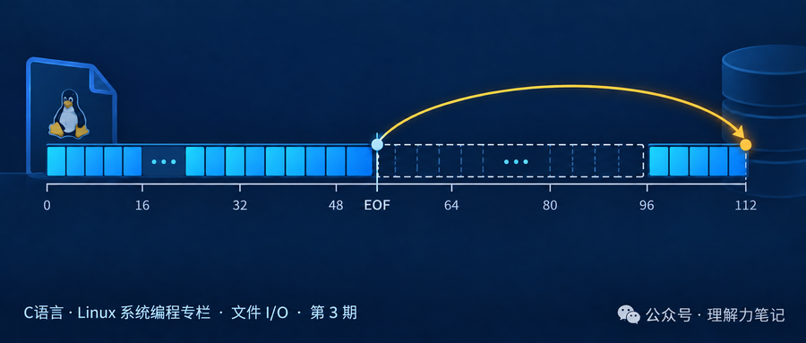
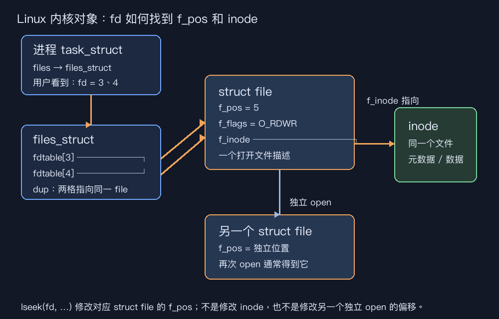

# `lseek` 到底改了什么？文件偏移、空洞与 `O_APPEND` 一次讲清



**这篇文章怎么读？**只想知道怎么定位，看第一章；想理解偏移量为什么会共享，看第二章；要写可靠代码，看第三章。

| 你是谁 | 看哪一章        | 会得到什么                      |
| --- | ----------- | -------------------------- |
| 搜索者 | 第一章 · 先解决问题 | `lseek` 的返回值和最小用法          |
| 学习者 | 第二章 · 机制解释  | 偏移量到底属于哪个内核对象              |
| 编程者 | 第三章 · 工程使用  | 稀疏文件、追加模式和错误处理边界           |
| 求职者 | 第四章 · 面试提炼  | `lseek` 与 `O_APPEND` 的关键区别 |

你可能见过这样的代码：

```c
lseek(fd, 0, SEEK_END);
write(fd, data, len);
```

它通常表示“移到文件尾再写”。但偏移量是 fd 自己的吗？如果定位到文件末尾之外再写，文件中间会填满 `0` 吗？

> **结论**：`lseek` 改的是打开文件描述里的当前偏移量，不是把文件内容搬家。偏移可以超过当前 EOF；此时写入会把文件长度推进到新位置加写入长度，中间区域读出来像 `0`，但通常不会真正占用同样多的磁盘块，这就是稀疏文件。当你使用 `O_APPEND` 标志打开一个文件时，所有的写入操作（`write`）都会自动、强制性地追加到文件的最末尾。你无法通过 `lseek` 改变下一次写入的位置。

## 第一章 · 先解决问题：`lseek` 改偏移，越过 EOF 写会留下空洞

### 最小实验

下面的程序先写入 `abc`，把偏移移到 5，再写入一个 `Z`；随后用 `O_APPEND` 重新打开，先 seek 到 0，再写一个 `Q`。完整代码在同目录的 `lseek_demo.c`。

```c
write(fd, "abc", 3);          /* 偏移从 0 变成 3 */
lseek(fd, 5, SEEK_SET);       /* 偏移变成 5，文件内容没变 */
write(fd, "Z", 1);            /* 写在 5，文件长度变成 6 */
```

### 编译与运行

```sh
cc -std=c17 -Wall -Wextra -Wpedantic -Wconversion -Wshadow -O0 -g lseek_demo.c -o lseek_demo
./lseek_demo
```

### 实际结果

```text
after writing 3 bytes, offset = 3
seek to offset 5, lseek returned = 5
after writing one byte, offset = 6
file size = 6 bytes
append fd seek to 0, offset = 0
after O_APPEND write, offset = 7
file size = 7 bytes
```

第一次写完 3 字节，当前位置是 3；`lseek` 到 5 只改变位置，不改变文件长度；写 1 字节后，文件长度变成 6。偏移 3 和 4 之间就是空洞。

第二次打开用了 `O_APPEND`。虽然 `lseek` 把当前偏移设成 0，`write("Q", 1)` 仍然追加到原文件尾，所以长度从 6 变成 7，写完后的偏移也是 7。

这个实验证明的是逻辑长度和定位行为；它不能单凭 `st_size` 证明空洞一定节省了多少磁盘空间，实际分配还要看文件系统和具体写入方式。


## 第二章 · 从操作系统视角理解：偏移量属于打开文件描述

### 涉及的系统对象

`open` 成功后，进程的 fd 表项会指向内核的“打开文件描述”（Linux 中常称 open file description）。它保存当前文件偏移、文件状态标志等信息，并继续指向具体文件对象。

所以要区分两件事：

- fd 是进程表里的整数索引；
- 当前偏移属于被 fd 指向的打开文件描述。

同一个打开文件描述被两个 fd 指向时，它们共享偏移；分别 `open` 同一个路径两次，则通常得到两个独立偏移。`dup` 复制的是指向同一打开文件描述的 fd，因此一个 fd `lseek` 后，另一个 fd 的当前位置也会变。



### 调用路径与状态变化

`lseek(fd, offset, whence)` 先找到 fd 对应的打开文件描述，再按 `SEEK_SET`、`SEEK_CUR` 或 `SEEK_END` 计算新偏移，并返回新位置。它只对支持定位的对象有效。

普通文件支持定位；管道、FIFO、socket 等流对象没有可供随机定位的文件偏移，对它们调用 `lseek` 会失败并设置 `errno = ESPIPE`。负的新偏移通常会失败并设置 `EINVAL`。

写入时，普通文件从当前偏移开始写，成功写入多少，偏移就前进多少。若当前位置超过 EOF，POSIX 允许形成“文件中的空洞”；从空洞读取时，系统返回值为 `0` 的字节，但这些字节不一定对应已经分配的物理块。

`O_APPEND` 是例外：每次写操作前，内核都把偏移定位到 EOF，并把定位和写入作为一个连续动作。它适合多个写者追加记录，但不等于“每次写入完整记录”或“写入内容永不交错”；记录大小和文件系统语义仍需单独设计。

## 第三章 · 工程上怎么使用：先选定位接口，再处理边界

### 接口选择

- 需要改变后续 `read`/`write` 的当前位置：用 `lseek`。
- 需要在指定位置读写，又不想改变共享偏移：优先 `pread`/`pwrite`；它们同样可能短读短写。
- 需要“无论别人怎么定位都追加到文件尾”：以 `O_APPEND` 打开，不要用“先 `lseek(SEEK_END)` 再 `write`”模拟。两步操作在并发写者之间可能发生竞态。

### 错误处理

`lseek` 成功返回新的 `off_t`，失败返回 `(off_t)-1`，这时才读取 `errno`。不要只判断返回值是否为 0，因为定位到文件开头本来就会返回 0；也不要把返回值强行存进 `int`，大文件偏移应使用 `off_t`。

```c
off_t end = lseek(fd, 0, SEEK_END);
if (end == (off_t)-1) {
    perror("lseek");
    /* 例如 fd 指向管道，errno 可能是 ESPIPE */
}
```

`SEEK_END` 得到的是当前文件长度对应的位置，不是“最后一个字节的下标”；长度为 6 的文件，EOF 偏移是 6，最后一个字节位于偏移 5。

### 资源与边界清单

1. `lseek` 不会扩展文件；真正让文件变长的是后续写入。
2. 稀疏文件读取时看到的空洞通常表现为零字节，但复制、备份或写满空洞时，空间占用可能增加。
3. `O_APPEND` 的追加位置由每次写入时的 EOF 决定，不能用一次 `lseek` 固定住。
4. 多线程或多进程共享同一打开文件描述时，依赖共享偏移会产生竞态；需要独立位置时使用 `pread`/`pwrite`。
5. `lseek` 不能用于 pipe、FIFO、socket；遇到 `ESPIPE` 应改用顺序读写。

## 第四章 · 面试提炼

### 简短回答

`lseek` 修改的是打开文件描述中的当前偏移量。它可以把偏移移到 EOF 之外，但不会立即改变文件大小；之后在那里写入会形成稀疏文件。`O_APPEND` 则在每次写前把偏移原子地移到 EOF，所以不能用 `lseek` 改变追加位置。

### 常见追问

- `dup` 后两个 fd 的偏移是否相同？是，因为它们共享打开文件描述。
- `open` 同一路径两次呢？通常是两个打开文件描述，偏移彼此独立。
- 为什么不用 `lseek(..., SEEK_END)` 加 `write` 做追加？并发下两步之间可能被其他写者插入，应该用 `O_APPEND`。

## 参考资料

- [POSIX `lseek`](https://pubs.opengroup.org/onlinepubs/9699919799/functions/lseek.html)
- [POSIX `open`](https://pubs.opengroup.org/onlinepubs/9699919799/functions/open.html)
- [Linux `lseek(2)`](https://man7.org/linux/man-pages/man2/lseek.2.html)
- [Linux `open(2)`](https://man7.org/linux/man-pages/man2/open.2.html)

转载说明：本文仅供学习交流，转载请保留「理解力笔记」署名及原文链接。
