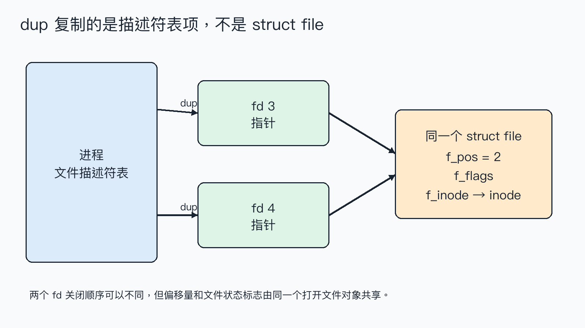
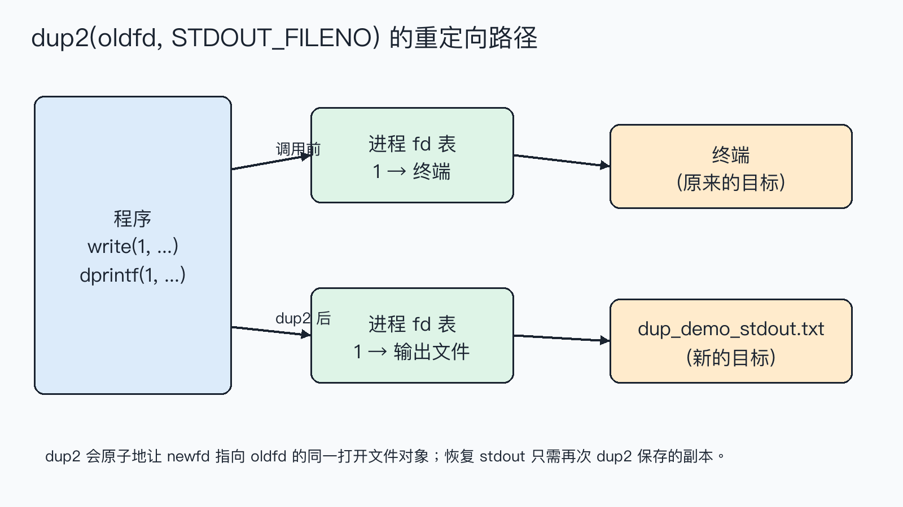

# `dup`/`dup2` 复制的到底是什么？从共享偏移到标准输出重定向

`dup(fd)` 返回了一个新的整数，看起来像是“复制了 fd”。但如果先用一个 fd 移动偏移，再用另一个 fd 写入，文件为什么会从新的位置发生变化？答案是：复制的是进程文件描述符表中的一项，两个 fd 仍指向同一个打开文件对象；`dup2` 正是利用这一点完成重定向。

> **结论：** `dup`/`dup2` 新建或替换的是 fd 表项，新旧 fd 共享打开文件描述中的当前偏移量和文件状态标志。把 `dup2(file_fd, STDOUT_FILENO)` 放在输出前，就能让标准输出写入 `file_fd` 指向的文件。


**这篇文章怎么读？**

无论你为什么点进来，都能各取所需——只解决手头问题，看第一章就够；想彻底搞懂，再往下读。

| 你是谁 | 看哪一章 | 会得到什么 |
| --- | --- | --- |
| 搜索者 / 被推荐者 | 第一章 · 先解决问题 | 最快的答案（知其然） |
| 学习者 | 第二章 · 机制解释 | 底层的来龙去脉（知其所以然） |
| 编程者 | 第三章 · 工程使用 | 正确、能直接用的写法 |
| 求职者 | 第四章 · 面试提炼 | 会怎么问、怎么答（按需） |

---

## 第一章 · 先解决问题：`dup` 共享打开文件对象，`dup2` 可以改写标准输出

### 最小实验

下面的程序先打开一个包含 `abc` 的文件，再复制 fd。把原 fd 的偏移移到 1 后，用副本写入 `X`；接着保存标准输出，用 `dup2` 把它指向另一个文件。

```c
int duplicate = dup(fd);
if (duplicate == -1) { /* 处理错误 */ }

lseek(fd, 1, SEEK_SET);
write(duplicate, "X", 1);     /* 从偏移 1 写入 */

int saved_stdout = dup(STDOUT_FILENO);
int output = open("dup_demo_stdout.txt", O_WRONLY | O_CREAT | O_TRUNC, 0600);
dup2(output, STDOUT_FILENO);  /* fd 1 改指向 output 的打开文件对象 */
close(output);
dprintf(STDOUT_FILENO, "hello through dup2\n");
dup2(saved_stdout, STDOUT_FILENO); /* 恢复 */
close(saved_stdout);
```

### 编译与运行

环境是 macOS 14.8.8、Apple clang 16.0.0。完整可运行文件为 `dup_demo.c`，使用严格警告编译：

```sh
cc -std=c17 -Wall -Wextra -Wpedantic -Wconversion -Wshadow -O0 -g dup_demo.c -o dup_demo
./dup_demo
```

### 实际结果

```text
original fd = 3, duplicate fd = 4
after lseek(original, 1): original offset = 1, duplicate offset = 1
write(duplicate, "X", 1) = 1, original offset = 2, duplicate offset = 2
file content = aXc
redirected output = hello through dup2
```

偏移在两个 fd 上同步变化，说明它们共享同一个打开文件对象；`dup2` 后写入标准输出的那一行被捕获到文件，而不是终端。实验只验证了普通文件和标准输出这两个场景，不代表所有设备都支持定位，也不替代并发写入的同步设计。

## 第二章 · 从操作系统视角理解：fd 表项指向同一个 `struct file`

在 Linux 中，进程拥有文件描述符表。表中的数字是索引，表项保存一个指向打开文件描述的引用；打开文件描述通常由内核的 `struct file` 表示，其中包含当前偏移 `f_pos`、状态标志以及指向 inode 的关系。`dup` 增加一个表项引用，并不复制这整个对象。



所以 `lseek(fd, 1, SEEK_SET)` 修改的是共享对象的 `f_pos`，随后通过 `duplicate` 写入就从偏移 1 开始；写完后两个 fd 观察到的偏移都变成 2。两次独立的 `open` 通常会得到两个不同的打开文件描述，它们的偏移互不共享，这与 `dup` 的结果不同。

`dup2(oldfd, newfd)` 做的是“让 `newfd` 指向 `oldfd` 指向的同一对象”。如果 `newfd` 原来已经打开，系统调用会先关闭它，再完成替换；当两个参数相等时则直接返回，不会先关闭再打开。替换动作由系统调用一次完成，适合建立重定向关系。



标准输出只是约定俗成的 fd 1。`printf` 最终经由 C 标准库和写入路径使用 fd 1；因此在进程内把 fd 1 的表项替换为文件，后续面向标准输出的写入自然沿着新的指向流入文件。这里的“重定向”不是修改 `printf`，而是修改它所使用的 fd。

## 第三章 · 工程上怎么使用：保存、替换、恢复都要检查返回值

### 接口选择

- 需要一个当前进程中指向同一打开文件对象的新 fd：用 `dup`。
- 需要让指定数字（最常见是 0、1、2）指向已有对象：用 `dup2(oldfd, newfd)`。
- Linux 专属代码还可以考虑 `dup3`，它能设置 `O_CLOEXEC`，但不能把相同 fd 作为两个参数。

### 错误处理与资源生命周期

`dup`、`dup2`、`open`、`close`、`read`、`write` 都要检查返回值。`dup2` 成功后，原来的 `oldfd` 仍然有效；只有确认不再需要它时才关闭。重定向前先 `dup(STDOUT_FILENO)` 保存副本，恢复时调用 `dup2(saved_stdout, STDOUT_FILENO)`，最后关闭副本。不要在 `dup2` 前手动 `close(newfd)`：那会扩大出错窗口，而且 `dup2` 本身已经定义了替换行为。

如果混用 `printf` 和 `write`，还要考虑 C 流的缓冲：重定向前后应先 `fflush(stdout)`，或者像实验一样直接使用 `dprintf`/`write`。多线程程序修改进程级的 0、1、2 会影响其他线程，通常应在创建线程前完成。

### 一个可复用的标准输出重定向框架

```c
int saved = dup(STDOUT_FILENO);
if (saved == -1) { /* 报错 */ }

if (dup2(target, STDOUT_FILENO) == -1) {
    close(saved);
    /* 报错 */
}
close(target);                    /* fd 1 已持有引用 */

/* 此处执行需要捕获 stdout 的代码 */

if (dup2(saved, STDOUT_FILENO) == -1) {
    close(saved);
    /* 报错 */
}
close(saved);
```

边界清单：确认 `oldfd` 有效；确认目标 fd 没有被别的逻辑同时使用；处理 `EINTR` 等失败；普通文件写入仍可能短写；进程执行 `exec` 前是否需要 `FD_CLOEXEC` 要明确设计；不要把共享偏移误当成并发安全。

## 第四章 · 面试提炼

### 简短回答

`dup` 复制的是文件描述符表项。新旧 fd 指向同一个打开文件描述，所以共享文件偏移和状态标志；`dup2` 还能把指定 fd 原子替换为这个指向，因此常用来做 stdin/stdout/stderr 重定向。

### 常见追问

**`dup` 和再次 `open` 有什么区别？** 再次 `open` 通常得到新的打开文件描述，偏移独立；`dup` 共享偏移和状态。

**为什么 `dup2` 前不用先 `close(newfd)`？** 因为 `dup2` 成功时会完成关闭和替换，手动关闭会增加竞态窗口。

**父子进程也共享偏移吗？** `fork` 后继承的 fd 指向原来的打开文件描述，因此通常共享偏移；这是另一个需要结合并发和写入原子性分析的问题。

## 参考资料

- [POSIX `dup`](https://pubs.opengroup.org/onlinepubs/9699919799/functions/dup.html)
- [POSIX `dup2`](https://pubs.opengroup.org/onlinepubs/9699919799/functions/dup2.html)
- [Linux `dup(2)`](https://man7.org/linux/man-pages/man2/dup.2.html)
- [Linux `open(2)`：open file description](https://man7.org/linux/man-pages/man2/open.2.html)

> 转载说明：本文用于技术学习与交流，转载请保留原文与出处。
