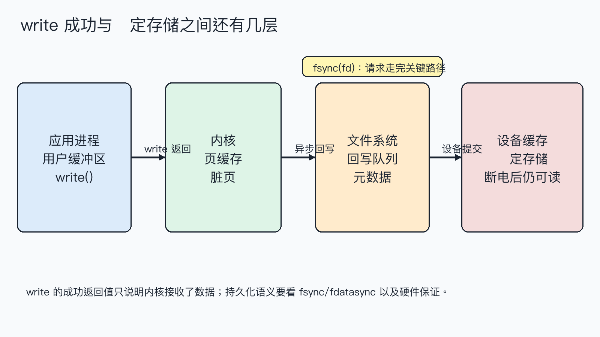
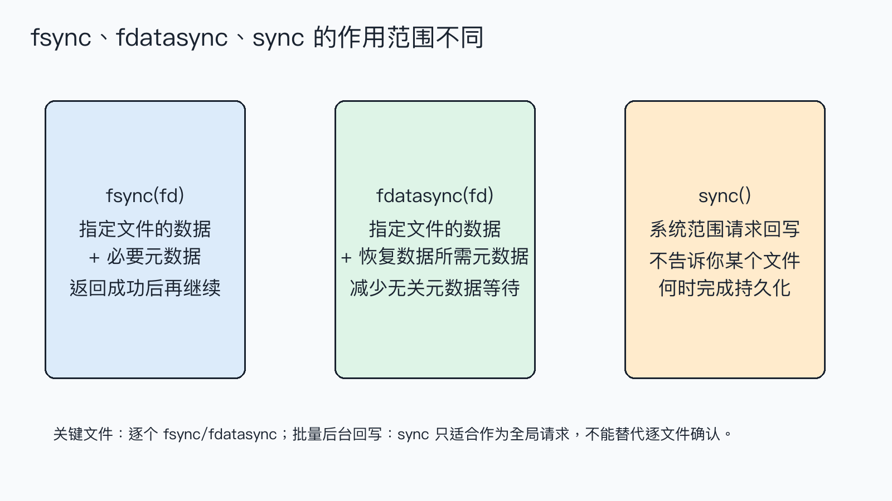

# `write` 成功就落盘了吗？理解 `fsync`

程序调用 `write` 返回成功后，数据通常已经进入内核，但这不等于拔掉电源后一定还能找回来。内核还可能把数据放在页缓存里，文件系统和存储设备也可能有自己的缓存。

> **结论：** `write` 的成功只代表内核接收了数据；要为某个文件请求持久化，使用 `fsync(fd)` 或按需求使用 `fdatasync(fd)`。`sync()` 是系统范围的回写请求，不是“确认这个文件已经安全”的替代品。最终保证还受文件系统、设备和断电保护能力影响。


**这篇文章怎么读？**

无论你为什么点进来，都能各取所需——只解决手头问题，看第一章就够；想彻底搞懂，再往下读。

| 你是谁 | 看哪一章 | 会得到什么 |
| --- | --- | --- |
| 搜索者 / 被推荐者 | 第一章 · 先解决问题 | 最快的答案（知其然） |
| 学习者 | 第二章 · 机制解释 | 底层的来龙去脉（知其所以然） |
| 编程者 | 第三章 · 工程使用 | 正确、能直接用的写法 |
| 求职者 | 第四章 · 面试提炼 | 会怎么问、怎么答（按需） |

---

## 第一章 · 先解决问题：`write` 接收成功不等于数据已经持久化

### 最小实验

程序分别写入两个文件：第一个调用 `fsync`，第二个调用 `fdatasync`，最后调用一次全局 `sync`。它验证的是接口调用和返回值，不模拟断电，也不能仅凭一次成功返回推断特定硬盘的抗断电能力。

```c
int data_fd = open("sync_data.txt", O_WRONLY | O_CREAT | O_TRUNC, 0600);
write_all(data_fd, "payload-123\n");
if (fsync(data_fd) == -1) {
    /* 处理错误 */
}

int meta_fd = open("sync_meta.txt", O_WRONLY | O_CREAT | O_TRUNC, 0600);
write_all(meta_fd, "payload-123\n");
if (fdatasync(meta_fd) == -1) {
    /* 处理错误 */
}
sync();
```

### 编译与运行

环境是 macOS 14.8.8、Apple clang 16.0.0。完整代码为 `sync_demo.c`：

```sh
cc -std=c17 -Wall -Wextra -Wpedantic -Wconversion -Wshadow -O0 -g sync_demo.c -o sync_demo
./sync_demo
```

### 实际结果

```text
write(data) = 12
fsync(data) = 0
write(meta) = 12
fdatasync(meta) = 0
sync() requested
```

`fsync` 和 `fdatasync` 返回 0，只说明本次同步请求被系统成功处理；`sync()` 在该平台返回 `void`，程序只能记录“已发出请求”。实验没有证明“任何设备断电后都不丢数据”，因为那需要具体硬件和文件系统测试。

## 第二章 · 从操作系统视角理解：数据要穿过页缓存、文件系统和设备缓存

普通 `write` 的路径不是“直接把字节塞进盘片”。用户缓冲区的数据先进入内核管理的页缓存，随后由文件系统安排脏页回写，再交给块设备；设备自身可能还有写缓存。



因此 `write` 返回时，内核可能已经接收数据但尚未完成后续回写。`fsync(fd)` 针对一个文件描述符，请求把该文件的数据以及恢复这些数据所需的元数据提交到稳定存储；成功返回后，调用者才获得接口层面更强的持久化保证。`fdatasync(fd)` 关注数据和必要元数据，允许省掉与数据恢复无关的部分元数据写入，具体节省多少取决于文件系统。

`sync()` 的作用范围更大：它请求系统把待回写的数据和元数据推进写回路径。它适合系统级维护场景，却没有“某个 fd 已经完成”的返回值，因此不能代替关键记录写入后的 `fsync(fd)`。



还要区分文件内容和目录项。新建文件、重命名文件时，文件内容的 `fsync` 不一定等于目录项本身已经持久化；需要保证“重启后文件名仍然存在”的场景，通常还要打开父目录并对目录 fd 调用 `fsync`。这是原子替换配置文件时常见的第二步。

## 第三章 · 工程上怎么使用：先定义持久化边界，再选同步接口

### 接口选择

- 关键文件内容必须在返回后具备持久化请求：使用 `fsync(fd)`。
- 只关心数据和恢复数据所需的元数据，想减少无关元数据等待：使用 `fdatasync(fd)`。
- 需要发起全局回写请求但不等待某个文件确认：使用 `sync()`；不要把它当作单文件提交证明。
- 需要“新文件名和内容一起 survive 重启”：写临时文件、同步文件、`rename`，再同步父目录。

### 错误处理与资源生命周期

同步调用返回 `-1` 时才读取 `errno`。`fsync` 可能因为 fd 无效、底层 I/O 错误或文件系统问题失败；失败不能被当成“稍后会自动安全落盘”。关闭文件也要检查返回值，但不能用 `close` 的成功替代显式 `fsync` 的语义。

示例框架：

```c
ssize_t count = write(fd, buffer, length);
if (count < 0) {
    /* 处理 errno；必要时重试 EINTR */
}
if ((size_t)count != length) {
    /* 处理短写，继续写剩余部分 */
}
if (fsync(fd) == -1) {
    /* 记录错误，不能宣称数据已持久化 */
}
if (close(fd) == -1) {
    /* 记录关闭阶段错误 */
}
```

同步会产生额外延迟，不应对每个无关小日志都调用一次。更常见的做法是把同步点放在事务提交、配置替换或用户明确要求“保存完成”的边界。网络文件系统、虚拟磁盘和带写缓存的设备还需要查清部署环境的承诺。

## 第四章 · 面试提炼

### 简短回答

`write` 成功表示数据被内核接收，不等于已经落到稳定存储。`fsync` 同步指定文件的数据和必要元数据，`fdatasync` 缩小元数据范围，`sync` 发起系统范围回写请求；关键文件应该在明确的提交点调用逐文件同步。

### 常见追问

**`fsync` 和 `fdatasync` 怎么选？** 默认先考虑 `fsync`；只有明确知道不需要额外元数据并且测量证明值得优化时，再用 `fdatasync`。

**调用 `close` 会自动落盘吗？** 不能把 `close` 当成持久化确认。需要持久化语义时，在关闭前显式同步并检查返回值。

**为什么同步文件后还要同步目录？** 文件内容和目录项是不同的持久化对象；要保证文件名在重启后仍存在，目录项也要提交。

## 参考资料

- [POSIX `fsync`](https://pubs.opengroup.org/onlinepubs/9699919799/functions/fsync.html)
- [Linux `fsync(2)` / `fdatasync(2)`](https://man7.org/linux/man-pages/man2/fsync.2.html)
- [Linux `sync(2)`](https://man7.org/linux/man-pages/man2/sync.2.html)
- [Linux `open(2)`](https://man7.org/linux/man-pages/man2/open.2.html)

> 转载说明：本文用于技术学习与交流，转载请保留原文与出处。
