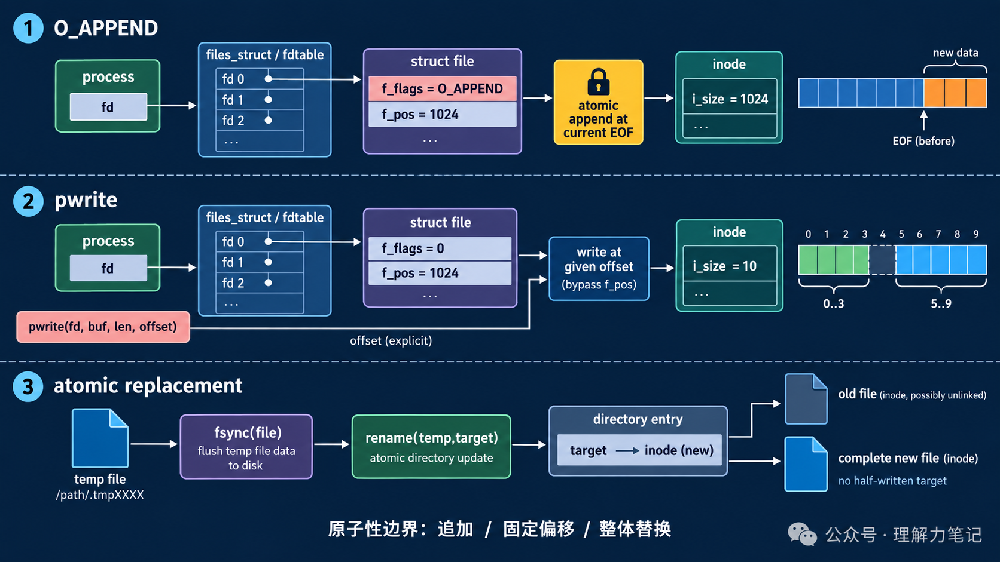

# 多进程写文件：`O_APPEND`、`pwrite` 与 `rename`

两个进程如果都先 `lseek(fd, 0, SEEK_END)`，再调用 `write`，它们看到的文件尾可能相同，后一次写入就会覆盖前一次的预期位置。问题不在“有没有调用 `lseek`”，而在定位和写入不是一个不可分割的动作。

> **结论：** 追加日志时用 `O_APPEND`，让每次 `write` 在内核中先定位到当前文件尾再写；固定偏移写入时用 `pwrite`，不要共享 `lseek` 改变的文件偏移；整体替换配置文件时，先写临时文件并同步，再用 `rename` 一次换名。三者解决的是不同的原子性问题。


**这篇文章怎么读？**

无论你为什么点进来，都能各取所需——只解决手头问题，看第一章就够；想彻底搞懂，再往下读。

| 你是谁 | 看哪一章 | 会得到什么 |
| --- | --- | --- |
| 搜索者 / 被推荐者 | 第一章 · 先解决问题 | 最快的答案（知其然） |
| 学习者 | 第二章 · 机制解释 | 底层的来龙去脉（知其所以然） |
| 编程者 | 第三章 · 工程使用 | 正确、能直接用的写法 |
| 求职者 | 第四章 · 面试提炼 | 会怎么问、怎么答（按需） |

---

## 第一章 · 先解决问题：先选对原子性边界，再写代码

### 最小实验

`atomic_io_demo.c` 做三件事：两个子进程各追加 5 条记录；用 `pwrite` 在偏移 0 和 5 写入两个互不重叠的片段；把完整内容写进临时文件后同步，再用 `rename` 替换目标文件。

追加部分的关键是打开标志：

```c
int fd = open(path, O_WRONLY | O_APPEND);
```

固定位置写入则直接传入偏移，不改变共享的 `f_pos`：

```c
if (pwrite(fd, "LEFT", 4, 0) != 4 ||
    pwrite(fd, "RIGHT", 5, 5) != 5) {
    /* 处理错误 */
}
```

### 编译与运行

环境是 macOS 14.8.8、Apple clang 16.0.0。完整可运行代码在 `atomic_io_demo.c`：

```sh
cc -std=c17 -Wall -Wextra -Wpedantic -Wconversion -Wshadow -O0 -g atomic_io_demo.c -o atomic_io_demo
./atomic_io_demo
```

### 实际结果

```text
O_APPEND records = 10 (expected 10)
pwrite offsets = 0 and 5 (non-overlapping)
rename replacement = complete-new-file
```

这个实验只证明本次运行观察到的系统调用结果：每条追加记录都被计数，`pwrite` 写到了指定偏移，替换后目标文件内容完整。它没有证明任意文件系统上的大块写入都不会被拆分，也没有模拟进程崩溃或断电。

## 第二章 · 从操作系统视角理解：原子性来自不同的内核状态变化

### `lseek` + `write` 为什么会竞争

普通 `lseek` 先修改打开文件对象里的 `f_pos`，随后 `write` 再使用这个偏移。两个进程若各自持有指向同一 `struct file` 的描述符，或者各自计算出相同的文件尾，定位和写入之间都存在调度窗口；另一个进程可以在窗口内改变偏移或写入数据。

### 三种调用的对象关系



`O_APPEND` 把“取当前文件尾并完成本次写入”绑定在一次写操作的内核路径中。它保证的是每次写入开始位置的追加语义；如果应用把一条记录拆成多次 `write`，记录之间仍可能交错，所以日志记录应尽量一次写完，并处理短写和错误。

`pwrite(fd, buf, count, offset)` 把偏移作为本次调用的参数，不使用也不更新打开文件对象的当前偏移。多个调用者只要分配了不重叠的区间，就不会因为共享 `f_pos` 而互相移动位置；区间重叠仍然是应用层的冲突。

`rename(old, new)` 在同一文件系统内更换目录项指向：读者通常看到旧文件或新文件，而不是“目标文件已经截断但内容只写了一半”。这解决的是名字指向的整体替换，不等于临时文件内容已经持久化；需要抗崩溃时，先 `fsync` 临时文件，成功 `rename` 后还要按平台要求同步父目录。

### 原子性不等于持久化

原子性回答“并发读写时能不能看到中间状态”；持久化回答“崩溃或断电后数据是否还在”。`O_APPEND` 和 `rename` 都不能替代 `fsync`。第 5 期讨论的同步边界，仍然适用于本期的临时文件替换流程。

## 第三章 · 工程上怎么使用：把写入目标、范围和提交点分开

### 追加日志：一次调用写完一条记录

- 打开时使用 `O_WRONLY | O_CREAT | O_APPEND`，并设置最小必要权限。
- 一条记录先在用户态拼好，再用一次 `write`/`write_all` 提交；不要把“取文件尾”单独写成 `lseek`。
- `write` 返回短写时继续写剩余部分；返回 `-1` 且 `errno == EINTR` 时重试，其他错误交给上层处理。
- 多进程共享一个日志文件时，记录长度、文件系统语义和吞吐要求都要实测；`O_APPEND` 不会替你设计跨多次调用的事务。

### 固定位置：用 `pwrite` 管理区间

`pwrite` 适合写文件头、预分配区域或按块更新。调用者需要维护“谁拥有哪一段偏移”的约定，并检查 `ssize_t` 返回值是否等于请求长度。若两个线程写同一范围，仍需锁、版本号或更高层的冲突解决策略。

### 整体替换：临时文件、同步、换名

可靠的配置替换通常按这个顺序：

1. 在目标目录创建临时文件，写入完整新内容。
2. 检查所有 `write` 返回值，并对临时文件调用 `fsync`。
3. `rename(temp, target)`，检查返回值。
4. Linux/POSIX 部署若要求重启后文件名也保留，再打开父目录并同步目录 fd；不同平台对此支持和要求有差异。
5. 清理失败路径上的临时文件，并记录哪个阶段失败。

不要先 `open(target, O_TRUNC)` 再慢慢写：进程在中途退出时，读者只能看到被截断的半成品。

## 第四章 · 面试提炼

### 简短回答

`lseek` 和 `write` 分开调用会产生竞争窗口。`O_APPEND` 把每次写入定位到文件尾的动作绑定起来，适合追加；`pwrite` 把偏移作为本次调用参数，适合不共享 `f_pos` 的固定位置写；`rename` 用一次目录项替换实现完整文件切换。它们解决并发可见性，不自动提供断电后的持久化保证。

### 常见追问

**`O_APPEND` 能保证一整条日志永不交错吗？** 只保证一次写调用的追加定位语义；应用若把记录拆成多次写，仍可能交错，长度和文件系统边界也要验证。

**`pwrite` 会改变当前文件偏移吗？** POSIX 语义下不会；它使用显式 `offset`，因此不依赖共享的 `f_pos`。

**`rename` 后是不是一定不丢？** 不是。它解决名字指向的原子替换；要提高崩溃恢复能力，还需同步临时文件以及按平台同步父目录。

## 参考资料

- [Linux `open(2)`](https://man7.org/linux/man-pages/man2/open.2.html)
- [Linux `pwrite(2)`](https://man7.org/linux/man-pages/man2/pwrite.2.html)
- [Linux `rename(2)`](https://man7.org/linux/man-pages/man2/rename.2.html)
- [POSIX `rename`](https://pubs.opengroup.org/onlinepubs/9699919799/functions/rename.html)
- [Linux `fsync(2)`](https://man7.org/linux/man-pages/man2/fsync.2.html)

> 转载说明：本文用于技术学习与交流，转载请保留原文与出处。
