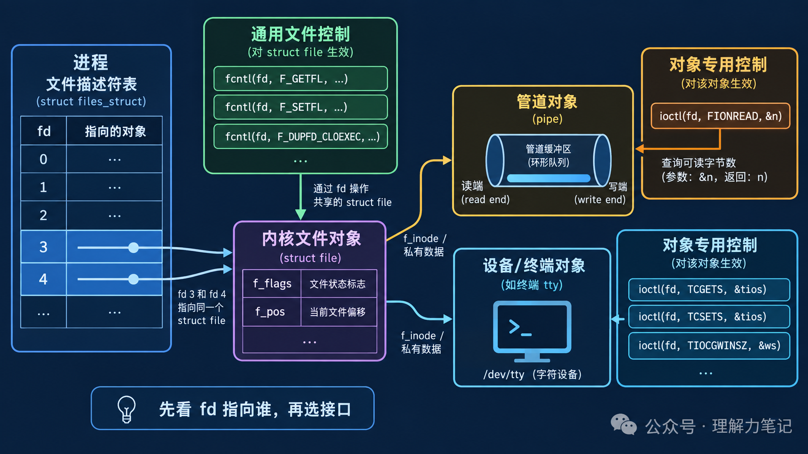

# `fcntl` 还是 `ioctl`？先看 fd 面向谁

`fcntl` 和 `ioctl` 都接收一个文件描述符，看起来像是“都能控制 fd”。真正的区别在于控制对象：`fcntl` 处理文件描述符、打开文件状态和记录锁；`ioctl` 把设备或特殊文件定义的命令传给对应对象。

> **结论：** 需要复制 fd、读取/修改 `O_APPEND` 等文件状态标志，或申请记录锁时，用 `fcntl`；需要查询管道、终端、套接字或设备的对象特有状态时，用该对象规定的 `ioctl` 命令。`ioctl` 没有一张适用于所有 fd 的通用命令表。


**这篇文章怎么读？**

无论你为什么点进来，都能各取所需——只解决手头问题，看第一章就够；想彻底搞懂，再往下读。

| 你是谁 | 看哪一章 | 会得到什么 |
| --- | --- | --- |
| 搜索者 / 被推荐者 | 第一章 · 先解决问题 | 最快的答案（知其然） |
| 学习者 | 第二章 · 机制解释 | 底层的来龙去脉（知其所以然） |
| 编程者 | 第三章 · 工程使用 | 正确、能直接用的写法 |
| 求职者 | 第四章 · 面试提炼 | 会怎么问、怎么答（按需） |

---

## 第一章 · 先解决问题：先判断控制对象，再选择接口

### 最小实验

下面这段最小程序可以直接编译运行：它对普通文件用 `fcntl` 读取并打开 `O_APPEND` 状态，再用 `F_DUPFD_CLOEXEC` 复制一个带 close-on-exec 的描述符；随后创建管道，写入 3 个字节，用管道支持的 `FIONREAD` 命令通过 `ioctl` 查询当前可读字节数。代码和下面的三行输出是一一对应的。

```c
#define _POSIX_C_SOURCE 200809L

#include <fcntl.h>
#include <stdio.h>
#include <stdlib.h>
#include <sys/ioctl.h>
#include <unistd.h>

int main(void)
{
    int fd = open("fcntl_demo.txt", O_RDWR | O_CREAT | O_TRUNC, 0600);
    if (fd == -1) return EXIT_FAILURE;
    int before = fcntl(fd, F_GETFL);
    if (before == -1 || fcntl(fd, F_SETFL, before | O_APPEND) == -1) return EXIT_FAILURE;
    int after = fcntl(fd, F_GETFL);
    int copy = fcntl(fd, F_DUPFD_CLOEXEC, 0);
    if (after == -1 || copy == -1) return EXIT_FAILURE;
    printf("fcntl O_APPEND: before=%s after=%s\n",
           (before & O_APPEND) != 0 ? "on" : "off",
           (after & O_APPEND) != 0 ? "on" : "off");
    printf("fcntl duplicated fd: original=%d copy=%d\n", fd, copy);
    int pipefd[2];
    if (pipe(pipefd) == -1 || write(pipefd[1], "abc", 3) != 3) return EXIT_FAILURE;
    int available = 0;
    if (ioctl(pipefd[0], FIONREAD, &available) == -1) return EXIT_FAILURE;
    printf("ioctl FIONREAD: %d bytes\n", available);
    (void)close(pipefd[0]);
    (void)close(pipefd[1]);
    (void)close(copy);
    (void)close(fd);
    return EXIT_SUCCESS;
}
```

### 编译与运行

环境是 macOS 14.8.8、Apple clang 16.0.0。上面的最小代码保存在 `minimal_usage.c`；包含更完整错误处理的版本在 `fcntl_ioctl_demo.c`：

```sh
cc -std=c17 -Wall -Wextra -Wpedantic -Wconversion -Wshadow -O0 -g fcntl_ioctl_demo.c -o fcntl_ioctl_demo
cc -std=c17 -Wall -Wextra -Wpedantic -Wconversion -Wshadow -O0 -g minimal_usage.c -o minimal_usage
./minimal_usage
```

### 实际结果

```text
fcntl O_APPEND: before=off after=on
fcntl duplicated fd: original=3 copy=4
ioctl FIONREAD: 3 bytes
```

这里的 fd 数字来自本次进程启动时的分配顺序，换一次运行可能不同；`O_APPEND` 从关闭变为打开、复制成功以及管道有 3 个可读字节，才是实验要观察的事实。`FIONREAD` 是管道支持的命令，不能据此推断普通文件、任意设备都支持同一命令。

## 第二章 · 从操作系统视角理解：`fcntl` 处理通用文件状态，`ioctl` 下沉到对象命令

### `fcntl` 的两层对象

一个进程的 fd 表项指向内核打开文件对象。`F_GETFL`/`F_SETFL` 读取或修改的是打开文件状态标志，例如 `O_APPEND`、非阻塞标志；`F_DUPFD_CLOEXEC` 创建新的 fd 表项，让它们指向同一个打开文件对象，但给新表项设置 close-on-exec 属性。描述符标志和文件状态标志不是同一层，`FD_CLOEXEC` 属于前者。



`F_SETLK`、`F_SETLKW` 等记录锁也通过 `fcntl` 进入，但这是协作式建议锁：其他进程必须检查或遵守锁，内核不会自动阻止所有绕过锁的写入。

### `ioctl` 为什么没有统一语义

`ioctl(fd, request, arg)` 把 `request` 和参数交给 fd 对应的对象实现。管道可以支持 `FIONREAD`，终端有窗口大小和终端属性命令，网络接口或设备节点又有自己的命令集合。内核根据对象类型分派处理函数；同一个数字命令不能脱离对象类型解释。

因此，`ioctl` 的返回值、参数类型、是否修改用户内存和错误码都必须查对应对象的手册或头文件。不能看到函数签名相似，就把一个设备的命令拿去操作普通文件。

### 两者都不是“万能加锁”

`fcntl` 的记录锁有进程关联、继承和关闭 fd 等边界；`ioctl` 更不等同于锁，除非特定设备明确规定某个命令提供互斥。并发设计仍要说明锁的持有者、释放路径和异常退出行为。

## 第三章 · 工程上怎么使用：把通用控制和对象专用控制分开

### 接口选择

| 需求 | 首选接口 | 原因 |
| --- | --- | --- |
| 复制 fd，或复制时设置 close-on-exec | `fcntl` / `F_DUPFD_CLOEXEC` | 操作进程 fd 表项 |
| 读取、修改 `O_APPEND`、非阻塞等状态 | `fcntl` / `F_GETFL`、`F_SETFL` | 操作打开文件状态 |
| 申请建议性记录锁 | `fcntl` / `F_SETLK(W)` | POSIX 文件记录锁语义 |
| 查询管道、终端、设备的专用状态 | 对应对象的 `ioctl` | 命令由对象类型定义 |

### 错误处理与资源生命周期

两种接口失败都返回 `-1`，只有失败后才读取 `errno`。`fcntl` 的命令决定第三个参数的类型，传错类型可能造成未定义行为；`ioctl` 的参数通常是指针，必须确认命令要求的结构体、读写方向和生命周期。

复制 fd 后，两个 fd 都需要明确由谁关闭；若设置了 `FD_CLOEXEC`，还要确认 `exec` 前是否确实需要继承。管道实验中，读端和写端都要关闭，不能只关闭“暂时不用”的一端，否则另一端可能一直等不到 EOF。

### 可复用的判断框架

1. 先确认 fd 实际指向普通文件、管道、终端、套接字还是设备。
2. 若需求属于 fd 表项、打开文件状态或 POSIX 记录锁，优先查 `fcntl`。
3. 若需求是对象特有能力，查该对象的 `ioctl` 命令定义，不凭函数名猜参数。
4. 对返回值、`errno`、短读短写和关闭路径逐项处理。
5. 在跨平台代码中把 `ioctl` 封装在平台适配层，避免把 Linux 或 BSD 私有命令泄漏到通用业务代码。

## 第四章 · 面试提炼

### 简短回答

`fcntl` 是文件描述符控制接口，覆盖 fd 复制、文件状态标志和建议性记录锁；`ioctl` 是对象相关的控制接口，命令由管道、终端、设备等具体对象定义。选择时先看 fd 指向谁，再看需求是通用文件状态还是对象专用能力。

### 常见追问

**`F_SETFL` 能修改所有打开标志吗？** 不能。它只允许修改实现规定的文件状态标志，访问模式等创建时属性不能随意改；应以目标平台手册为准。

**`F_DUPFD_CLOEXEC` 和 `dup` 有什么差异？** 都创建指向同一打开文件对象的新 fd，但前者可以在复制时设置 close-on-exec，避免先复制再设置时的竞态窗口。

**`ioctl` 能不能替代 `fcntl` 加锁？** 不能笼统替代。只有目标对象明确提供并定义了锁语义时，某个 ioctl 命令才有相应作用；普通文件的建议性记录锁应查 `fcntl`。

## 参考资料

- [POSIX `fcntl`](https://pubs.opengroup.org/onlinepubs/9699919799/functions/fcntl.html)
- [Linux `fcntl(2)`](https://man7.org/linux/man-pages/man2/fcntl.2.html)
- [Linux `ioctl(2)`](https://man7.org/linux/man-pages/man2/ioctl.2.html)
- [Linux `pipe(7)`](https://man7.org/linux/man-pages/man7/pipe.7.html)

> 转载说明：本文用于技术学习与交流，转载请保留原文与出处。
