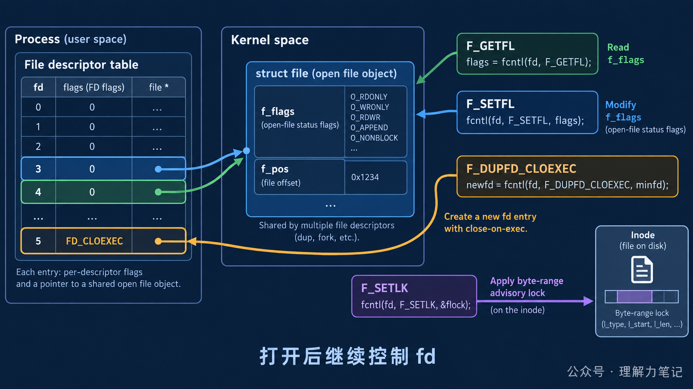

# `fcntl`：文件打开后，如何控制一个 fd？

文件一旦 `open` 成功，很多程序还需要改变它的行为：追加写、设置非阻塞、避免 `exec` 泄漏，或者让多个进程协作访问同一段文件。为每种变化重新打开文件既麻烦，也可能改变访问模式。

> **结论：** `fcntl` 用命令参数控制已经打开的文件描述符：`F_GETFL` / `F_SETFL` 读取或修改打开文件状态，`F_DUPFD_CLOEXEC` 复制并设置 close-on-exec，`F_SETLK` / `F_SETLKW` 申请建议性记录锁。先区分命令操作的是 fd 表项还是打开文件对象，再处理返回值和生命周期。


**这篇文章怎么读？**

无论你为什么点进来，都能各取所需——只解决手头问题，看第一章就够；想彻底搞懂，再往下读。

| 你是谁 | 看哪一章 | 会得到什么 |
| --- | --- | --- |
| 搜索者 / 被推荐者 | 第一章 · 先解决问题 | 最快的答案（知其然） |
| 学习者 | 第二章 · 机制解释 | 底层的来龙去脉（知其所以然） |
| 编程者 | 第三章 · 工程使用 | 正确、能直接用的写法 |
| 求职者 | 第四章 · 面试提炼 | 会怎么问、怎么答（按需） |

---

## 第一章 · 先解决问题：用 `fcntl` 在打开后改变 fd 行为


我们可以用一个通俗的例子来理解close-on-exec：

假设你（**父进程**）手里正拿着一本日记本（**文件描述符 / File Descriptor**）在读写。

1. **你克隆了自己**：你调用 `fork()` 创造了一个分身（**子进程**）。这个分身非常懂你，他手里也同样拿着**这同一本日记本**。
2. **分身去干别的事**：你让分身去干一件完全不同的工作（调用 `exec` 执行新程序，比如让他去扫地）。
3. **这时候分身面临选择**：
    - **如果没有设置 `close-on-exec`**：分身去扫地的时候，手里依然死死攥着那本日记本。如果这个扫地的程序不安全，日记内容可能就会泄露。
    - **如果设置了 `close-on-exec`**：分身在变身成“扫地僧”的**那一刹那**，系统会强行把他手里的日记本给**合上并没收（Close）**。

总结谁被关闭了：

- **谁被关闭了？** 是**子进程**在执行新程序时，它继承过来的**那个具体的文件、套接字（Socket）或管道（Pipe）**被关闭了。
- **谁没被关闭？** 你（**父进程**）手里的那个文件依然好好的，不受任何影响。

### 最小实验

这段程序可以直接编译运行：先读取普通文件的状态标志，再打开 `O_APPEND`，最后复制一个带 close-on-exec 的 fd。代码和下面的输出一一对应。

```c
#define _POSIX_C_SOURCE 200809L

#include <fcntl.h>
#include <stdio.h>
#include <stdlib.h>
#include <unistd.h>

int main(void)
{
    int fd = open("fcntl_demo.txt", O_RDWR | O_CREAT | O_TRUNC, 0600);
    if (fd == -1) return EXIT_FAILURE;
    int before = fcntl(fd, F_GETFL);
    if (before == -1 || fcntl(fd, F_SETFL, before | O_APPEND) == -1) return EXIT_FAILURE;
    int after = fcntl(fd, F_GETFL);
    int copy = fcntl(fd, F_DUPFD_CLOEXEC, 0);
    if (after == -1 || copy == -1) return EXIT_FAILURE;
    printf("F_GETFL/F_SETFL: before=%s after=%s\n",
           (before & O_APPEND) != 0 ? "append" : "normal",
           (after & O_APPEND) != 0 ? "append" : "normal");
    printf("F_DUPFD_CLOEXEC: original=%d copy=%d\n", fd, copy);
    (void)close(copy);
    (void)close(fd);
    return EXIT_SUCCESS;
}
```

### 编译与运行

环境是 macOS 14.8.8、Apple clang 16.0.0。上面的最小代码保存在 `minimal_usage.c`；包含记录锁和完整错误路径的版本在 `fcntl_demo.c`：

```sh
cc -std=c17 -Wall -Wextra -Wpedantic -Wconversion -Wshadow -O0 -g minimal_usage.c -o minimal_usage
./minimal_usage
```

### 实际结果

```text
F_GETFL/F_SETFL: before=normal after=append
F_DUPFD_CLOEXEC: original=3 copy=4
```

fd 数字来自本次进程启动时的分配顺序，换一次运行可能不同；状态从 `normal` 变成 `append`，以及复制成功，才是实验要观察的事实。

## 第二章 · 从操作系统视角理解：一个调用连接两个内核对象层次

进程的 fd 表项保存“这个进程用哪个整数访问对象”；表项再指向打开文件对象，里面有当前偏移、状态标志和引用关系。`F_GETFL` / `F_SETFL` 面向打开文件状态，`F_DUPFD_CLOEXEC` 则创建新的 fd 表项并设置 close-on-exec。



### 状态标志与描述符标志不是一层

`O_APPEND`、非阻塞等属于打开文件状态，多个指向同一打开文件对象的 fd 可能共享它们；`FD_CLOEXEC` 属于单个 fd 表项，复制 fd 时应使用 `F_DUPFD_CLOEXEC` 或明确设置，避免把不该继承的描述符带入 `exec` 后的新程序。

### 记录锁是协作式协议

`F_SETLK` 申请非阻塞记录锁，拿不到时通常返回 `EACCES` 或 `EAGAIN`；`F_SETLKW` 则可以等待。锁只对遵守这套协议的进程有约束力，不能替代对所有写路径的强制拦截。完整实验 `fcntl_demo.c` 会让父进程持锁，再让子进程尝试同一范围，观察失败返回。

## 第三章 · 工程上怎么使用：按需求选择命令并清理资源

### 常见场景

| 需求 | `fcntl` 命令 | 注意点 |
| --- | --- | --- |
| 查询或修改追加、非阻塞等状态 | `F_GETFL` / `F_SETFL` | 只修改允许修改的状态位，保留其他位 |
| 复制并防止 `exec` 泄漏 | `F_DUPFD_CLOEXEC` | 新旧 fd 都要明确关闭责任 |
| 申请文件区域建议锁 | `F_SETLK` / `F_SETLKW` | 约定锁范围、持有者和释放路径 |

### 错误处理

`fcntl` 返回 `-1` 时才读取 `errno`。不同命令的第三个参数类型不同：状态标志是整数，记录锁是 `struct flock *`；不能把一个命令的参数形式套到另一个命令上。修改状态后再次 `F_GETFL` 检查，能让实验和诊断更可靠。

### 资源生命周期

复制 fd 后，两个 fd 都指向同一个打开文件对象，但它们仍是两个需要关闭的整数句柄。加锁进程退出或关闭相关 fd 后，锁的行为还受平台语义影响；工程代码应在正常路径和错误路径都显式解锁、关闭并记录失败。

## 第四章 · 面试提炼

### 简短回答

`fcntl` 让程序在文件打开后继续控制 fd：`F_GETFL` / `F_SETFL` 管打开文件状态，`F_DUPFD_CLOEXEC` 管 fd 复制和继承边界，`F_SETLK(W)` 管建议性记录锁。选择命令时先确认对象层次，再检查命令对应的参数、返回值和资源释放。

### 常见追问

**`F_SETFL` 能修改访问模式吗？** 不能随意修改。它主要修改实现允许的状态标志，例如追加和非阻塞；访问模式应在 `open` 时确定。

**复制出来的 fd 是否拥有独立偏移？** 不一定。复制 fd 指向同一个打开文件对象，文件偏移等状态可能共享；需要独立偏移时应重新打开或使用显式偏移接口。

**记录锁是不是强制锁？** 不是。它是建议性协议，其他代码绕过锁仍可能访问同一文件。

## 参考资料

- [POSIX `fcntl`](https://pubs.opengroup.org/onlinepubs/9699919799/functions/fcntl.html)
- [Linux `fcntl(2)`](https://man7.org/linux/man-pages/man2/fcntl.2.html)
- [Linux `open(2)`](https://man7.org/linux/man-pages/man2/open.2.html)

## 往期推荐

- [第一期：文件描述符到底是什么？close 之后发生了什么](https://mp.weixin.qq.com/s/qDgvriMb2psvm0h0xOl2Qw)
- [第二期：一看就懂的：read/write 只读/写了一半，不是你的代码错了](https://mp.weixin.qq.com/s/cerNsgDYf2PaVnbNG_6i4Q)
- [第三期：lseek 到底改了什么？文件偏移、空洞与 O_APPEND 一次讲清](https://mp.weixin.qq.com/s/LK7COx11puI5rJ6hys6yxQ)

> 转载说明：本文用于技术学习与交流，转载请保留原文与出处。
